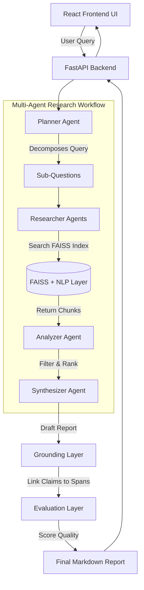

# ResearchMind 🧠
**A fully autonomous, multi-agent RAG system with evidence grounding, evaluation, and a React interface.**

ResearchMind is not just another wrapper around an LLM. It is an end-to-end pipeline that ingests documents, decomposes complex queries into research plans, hits local vector stores, synthesizes findings, explicitly grounds its claims to source spans to eliminate hallucinations, and quantitatively evaluates its own performance.

## 🏗️ Architecture



## 🛠️ Tech Stack

| Layer | Technology |
|---|---|
| **Document Ingestion** | pypdf, tiktoken |
| **Classical NLP** | scikit-learn, spaCy, networkx |
| **Semantic Search** | FAISS, sentence-transformers |
| **LLM Inference** | Groq (llama-3.1-8b-instant) |
| **Agentic Workflow** | Custom planner/researcher/synthesizer/analyzer modules |
| **Evidence Grounding** | all-MiniLM-L6-v2 + sliding window cosine similarity |
| **Evaluation** | Custom Faithfulness / Relevance / Precision metrics |
| **Backend** | FastAPI, uvicorn |
| **Frontend** | React, Vite, Tailwind CSS |

## ✨ Features

What makes this system non-trivial compared to standard RAG?

1. **Multi-Step Agentic Workflow:** Instead of stuffing chunks into a prompt, ResearchMind features a *Planner* that breaks down complex queries, *Researchers* that individually investigate sub-questions, and an *Analyzer* that filters out low-confidence noise before Synthesis.
2. **Strict Evidence Grounding:** To combat LLM hallucinations, a custom Grounding Layer tokenizes the synthesized report and maps every single claim back to the exact character spans in the source documents using semantic sliding windows. It appends rigorous footnotes and flags hallucinated claims with `[UNGROUNDED]`.
3. **Automated Evaluation Layer:** Every run is scored on Faithfulness, Answer Relevance, Context Precision, and Hallucination Risk. You aren't guessing if the system is improving; you are tracking it empirically over time.
4. **Hybrid NLP + GenAI:** Uses spaCy for named entity recognition (NER) and classical keyword extraction alongside dense vector embeddings, ensuring specific noun-phrases aren't lost in dense vector spaces.

## 🚀 Setup Instructions

Assume a fresh machine (MacOS/Linux).

### 1. Backend Setup
```bash
# Clone and enter the directory
git clone https://github.com/yourusername/researchmind.git
cd researchmind

# Create and activate a virtual environment
python3 -m venv venv
source venv/bin/activate

# Install dependencies
pip install -r requirements.txt

# Download the required spaCy model for the NLP engine
python -m spacy download en_core_web_sm

# Configure your environment
cp .env.example .env
# Edit .env and add: GROQ_API_KEY=your_groq_api_key

# Start the FastAPI backend
uvicorn api.main:app --reload --port 8000
```

### 2. Frontend Setup
Open a new terminal window:
```bash
cd researchmind/frontend
npm install
npm run dev
```
Navigate to `http://localhost:5173` to view the application!

## 💻 CLI Usage Examples

You can orchestrate the entire pipeline directly from the terminal.

```bash
# Ingest a PDF or text file
python cli.py ingest /path/to/document.pdf
# Output: Ingested document.pdf into 24 chunks.

# Run NLP extraction on the chunks
python cli.py nlp
# Output: Extracted keywords and entities for 24 chunks.

# Run a full agentic research query
python cli.py research "What are the core capabilities of the ingested document?"
# Output: 
# Step 1: Planning...
# Step 2: Researching 4 sub-questions...
# Step 3: Analyzing evidence...
# Step 4: Synthesizing report...
# Step 5: Grounding evidence... Faithfulness: 0.85 | Coverage: 0.90
# Step 6: Running evaluation metrics... Overall score: 0.88
```

## 📡 API Endpoints

| Method | Endpoint | Description |
|---|---|---|
| `POST` | `/api/documents/ingest` | Upload and chunk a new document |
| `GET` | `/api/documents` | List all ingested documents |
| `POST` | `/api/research` | Trigger the background multi-agent research workflow |
| `GET` | `/api/research/reports/{id}` | Poll the status and retrieve the final grounded report |
| `GET` | `/api/research/evals` | Retrieve the historical run table with all quality scores |
| `GET` | `/api/research/evals/summary` | Retrieve global aggregated metric averages |

## 📊 Evaluation Metrics

ResearchMind doesn't just guess quality; it calculates it:
- **Faithfulness:** The ratio of generated sentences that can be semantically mapped back to a source chunk.
- **Answer Relevance:** Cosine similarity between the original query and the final generated report.
- **Context Precision:** The percentage of retrieved chunks that were actually semantically useful to the question (Score > 0.4).
- **Hallucination Risk:** The inverse of faithfulness (`1.0 - Faithfulness`), explicitly highlighting sentences the LLM invented.

## 📂 Project Structure

```text
researchmind/
├── agent/            # Planner, Researcher, Synthesizer logic
├── api/              # FastAPI routes and schemas
├── evaluation/       # Metrics, Evaluator, and JSON tracker
├── frontend/         # React, Vite, Tailwind UI
├── genai/            # Groq API client integration
├── grounding/        # Claim-to-span semantic linking
├── ingestion/        # PDF/txt loaders and chunking logic
├── models/           # Shared Python dataclasses
├── nlp/              # spaCy NER and keyword extraction
├── tests/            # pytest evaluation and integration tests
├── vectorstore/      # Local FAISS index and sentence-transformers
└── cli.py            # Rich terminal application
```
