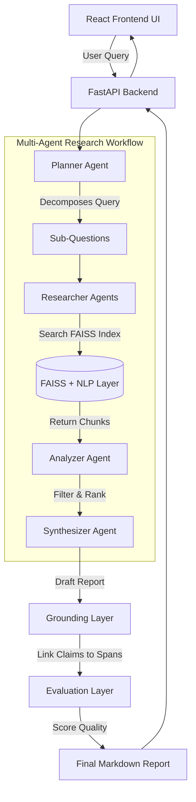

# ResearchMind 🧠


**ResearchMind (ReMi) is an autonomous, multi-agent RAG system that reads your documents, runs deep research workflows, and generates rigorously cited reports.** 

Unlike simple chat wrappers, ResearchMind features a beautiful web interface, explicitly grounds its claims to exact source text (to eliminate hallucinations), and quantitatively evaluates its own performance on every run.

## 🚀 Quick Start (5 Minutes)

Assume a fresh machine (MacOS/Linux) with Python 3.11+ and Node.js installed.

1. **Clone & Setup Backend**
```bash
git clone https://github.com/divyasingh1/ReMi.git
cd ReMi
python3 -m venv venv
source venv/bin/activate
pip install -r requirements.txt
python -m spacy download en_core_web_sm
```

2. **Configure Environment**
```bash
cp .env.example .env
# Edit .env and add your GROQ_API_KEY
```

3. **Start the App**
```bash
# Start backend on port 8000
python cli.py serve &

# Start frontend UI in a new terminal
cd frontend
npm install
npm run dev
```

Navigate to `http://localhost:5173` to view the application!

---

## 🏗️ Architecture



## ✨ Features

1. **Beautiful Web Interface:** Upload PDFs, manage documents, search, chat, and trigger autonomous research workflows from a premium, responsive UI.
2. **Multi-Step Agentic Workflow:** A *Planner* breaks down complex queries, *Researchers* investigate sub-questions, and an *Analyzer* filters out noise before Synthesis.
3. **Strict Evidence Grounding:** A custom Grounding Layer maps every claim back to exact character spans in the source documents using semantic sliding windows.
4. **Automated Evaluation:** Every run is scored on Faithfulness, Answer Relevance, Context Precision, and Hallucination Risk.

## 💻 CLI Usage

You can also orchestrate the entire pipeline directly from the terminal.

```bash
# Ingest a PDF or text file
python cli.py ingest /path/to/document.pdf

# Run a full agentic research query
python cli.py research "What are the core capabilities of the ingested document?"

# Check document store stats
python cli.py stats
```

## 📊 Evaluation Metrics

ResearchMind doesn't just guess quality; it calculates it:
- **Faithfulness:** Ratio of generated sentences that map back to a source chunk.
- **Answer Relevance:** Cosine similarity between query and final report.
- **Context Precision:** Percentage of retrieved chunks that were actually useful.
- **Hallucination Risk:** Inverse of faithfulness (1.0 - Faithfulness).
